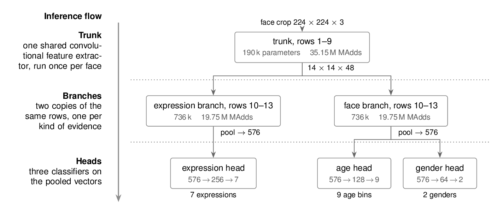
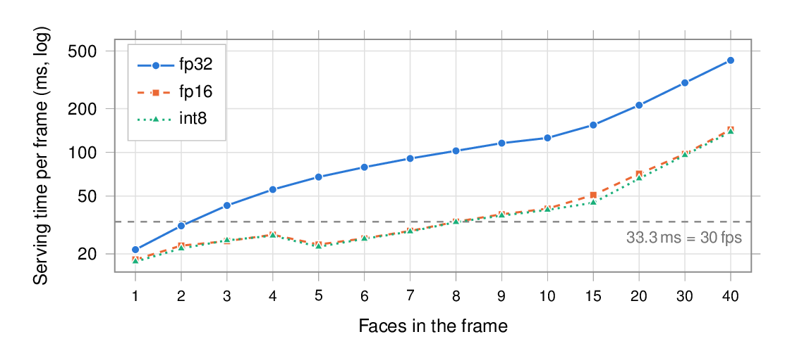
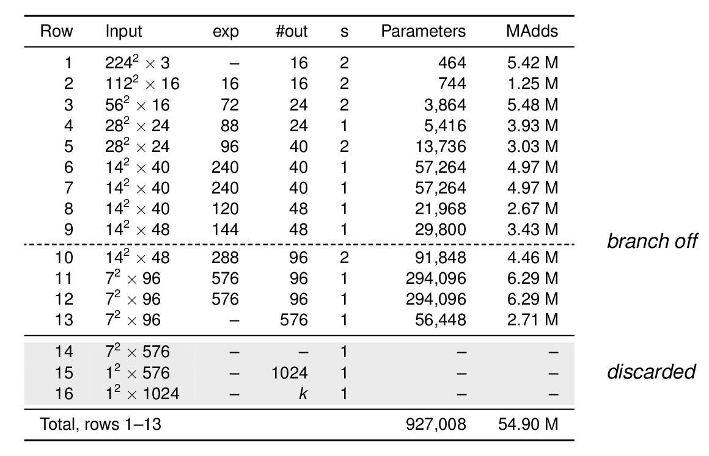

# edge-realtime-face-attribute-predictor

Real-time age, gender and facial expression recognition on an iPhone. One small
multi-task network based on MobileNetV3-Small, trained in PyTorch, converted to
Core ML and run live on the camera feed. Tested on an iPhone 14.

University project for IU, module DLBAIPEAI (Project: Edge AI).



The network shares one trunk (MobileNetV3-Small rows 1–9) and splits into two
branches after row 9. The expression branch feeds a 7-class head, the face
branch feeds a 9-bin age head and a 2-class gender head. 1.93 M parameters and
74.91 M MAdds per face, compared with 164.95 M for three single-task models
(−54.6 %).

## Results

Deployed model (branch after row 9). Age and gender on the FairFace validation
split (10,954 images), expression on the RAF-DB test split (3,068 images).

| | PyTorch fp32 | Core ML fp32 | Core ML fp16 | Core ML int8 |
|---|---:|---:|---:|---:|
| Macro F1 age | 0.5162 | 0.5171 | 0.5174 | 0.5155 |
| Macro F1 gender | 0.9241 | 0.9240 | 0.9236 | 0.9248 |
| Macro F1 expression | 0.7024 | 0.6997 | 0.7003 | 0.6986 |
| Model time per face (ms) | 0.25 | 9.12 | 2.00 | 1.91 |
| Serving time per frame, one face (ms) | – | 21.4 | 18.3 | 17.7 |
| Resident memory of the app (MB) | – | 60.5 | 42.3 | 40.1 |
| Model size (MB) | – | 7.44 | 3.80 | 2.04 |

PyTorch times are per image in batches of 64 on a GPU, so not directly
comparable. Phone numbers are medians from one 160.1 s recording at 720p
(2,728 frames).

Accuracy: age 0.5495, gender 0.9243, expression 0.7989. Collapsed to
adult/elderly, age reaches accuracy 0.9719 and macro F1 0.8026.



Median serving time per frame against the number of faces in view. fp32 stays
under 33.3 ms (30 fps) up to two faces, fp16 and int8 up to eight.

### All trained configurations

| Configuration | Age Acc. | Age F1 | Gender Acc. | Gender F1 | Expr. Acc. | Expr. F1 |
|---|---:|---:|---:|---:|---:|---:|
| **Branch after row 9 (deployed)** | 0.5495 | 0.5162 | 0.9243 | 0.9241 | 0.7989 | 0.7024 |
| Branch after row 5 | 0.5571 | 0.5295 | 0.9267 | 0.9265 | 0.8061 | 0.7284 |
| Branch after row 4 | 0.5613 | 0.5256 | 0.9233 | 0.9231 | 0.8054 | 0.7246 |
| Single-task age | 0.5667 | 0.5480 | – | – | – | – |
| Single-task gender | – | – | 0.9242 | 0.9240 | – | – |
| Single-task expression | – | – | – | – | 0.7953 | 0.7137 |

Row 5 scores a bit higher but costs 90.94 M instead of 74.91 M MAdds per face,
because four more rows run twice. Every run is a single seed.

## How it works on the phone

1. Vision detects the face landmarks on every frame.
2. Around them the app builds a square in which the landmark hull fills 0.82,
   the same share as in the FairFace crops.
3. The square is rolled upright by the face roll from Vision and cut out with
   Core Image.
4. Only this crop goes into Core ML. Classification runs every 5th frame,
   detection on every frame.
5. A nearest-centre tracker keeps the labels on the faces. Per-frame metrics
   can be shared as CSV.

The app can switch between fp32, fp16 and int8, front and back camera, 720p and
1080p, blur the faces, and show the debug boxes for every crop stage.

## Repository

```
predictor/
  definition.py      model, trunk + two branches + three heads
  dataloader.py      FairFace + RAF-DB, 50:50 sampler, missing labels as -1
  prepare_rafdb.py   crops RAF-DB once into squares
  train.py           AdamW, cosine annealing, uncertainty weighted losses
  predict.py         predictions for a split or a folder, torch or coreml
  eval.py            accuracy, macro F1, per class, ±1 bin, adult/elderly
  export.py          Core ML export in fp32, fp16 and int8
  run_all.sh         every run, primary model first
  artifacts/         logs, training curves, eval tables and predictions
app/
  FaceAttributes/    SwiftUI app: camera, Vision, Core ML, overlay, metrics
docs/                figures for this readme
```

Checkpoints (`*.pt`) and Core ML packages (`*.mlpackage`) are not in the repo.

## Datasets

Neither dataset is in this repository. Both have to be downloaded separately.

**FairFace** ([paper](https://doi.org/10.1109/WACV48630.2021.00159),
[GitHub](https://github.com/joojs/fairface)). 97,700 face crops, 86,744 train
and 10,954 validation, labelled with 9 age bins, gender and race. Used for age
and gender. The `margin025` image version is used, licensed CC BY 4.0.

**RAF-DB**, Real-world Affective Faces Database
([paper](https://doi.org/10.1109/CVPR.2017.277),
[website](http://www.whdeng.cn/RAF/model1.html)). 15,339 images, 12,271 train
and 3,068 test, with 7 basic expressions. Used for expression, plus its gender
labels and its two outer age ranges (0–3 and 70+). Released only on request
for non-commercial research and must not be redistributed.

**ImageNet** ([paper](https://doi.org/10.1109/CVPR.2009.5206848)). Not
downloaded. The trunk starts from the torchvision MobileNetV3-Small weights
pretrained on it.

Expected layout:

```
datasets/
  fairface/
    fairface_label_train.csv
    fairface_label_val.csv
    train/  val/                  from fairface_img_margin025.zip
  raf_db/
    EmoLabel/list_patition_label.txt
    original/                     from Image/original.zip
    boundingbox/
    Annotation/manual.zip
```

`prepare_rafdb.py` writes `raf_db/cropped/` and `raf_db/attributes.txt`.

## Running it

Python 3.12 with torch 2.13, torchvision 0.28, coremltools 9.0, numpy, pillow
and scikit-learn. Training expects a CUDA GPU.

```
python -m venv .venv
.venv/bin/pip install torch torchvision coremltools numpy pillow scikit-learn
cd predictor
./run_all.sh
```

`run_all.sh` crops RAF-DB, trains all six configurations, predicts and
evaluates each one, and exports the deployed model. Runs that already have a
checkpoint are skipped. A single run:

```
../.venv/bin/python train.py --run-name multitask_row9 --branch-row 9
../.venv/bin/python predict.py --run-name multitask_row9 --images val
../.venv/bin/python eval.py --run-name multitask_row9
../.venv/bin/python export.py --run-name multitask_row9 --branch-row 9
```

For the app, copy `artifacts/multitask_row9_<precision>.mlpackage` to
`app/FaceAttributes/FaceAttributeModel_<precision>.mlpackage` and open
`app/FaceAttributes.xcodeproj` in Xcode.

## MobileNetV3-Small rows



The 16 rows of MobileNetV3-Small 1.0, numbered as in Table 2 of Howard et al.
(2019). The model branches after row 9. Rows 14–16, the ImageNet classifier,
are dropped. Parameter and MAdd counts are measured on the implemented model.

## References

- Deng, J., Dong, W., Socher, R., Li, L.-J., Li, K., & Fei-Fei, L. (2009).
  ImageNet: A large-scale hierarchical image database. *CVPR 2009*, 248–255.
  https://doi.org/10.1109/CVPR.2009.5206848
- Howard, A., Sandler, M., Chu, G., Chen, L.-C., et al. (2019). Searching for
  MobileNetV3. *ICCV 2019*, 1314–1324. https://doi.org/10.1109/ICCV.2019.00140
- Kärkkäinen, K., & Joo, J. (2021). FairFace: Face attribute dataset for
  balanced race, gender, and age for bias measurement and mitigation.
  *WACV 2021*, 1547–1557. https://doi.org/10.1109/WACV48630.2021.00159
- Kendall, A., Gal, Y., & Cipolla, R. (2018). Multi-task learning using
  uncertainty to weigh losses for scene geometry and semantics. *CVPR 2018*,
  7482–7491. https://doi.org/10.1109/CVPR.2018.00781
- Li, S., Deng, W., & Du, J. (2017). Reliable crowdsourcing and deep
  locality-preserving learning for expression recognition in the wild.
  *CVPR 2017*, 2584–2593. https://doi.org/10.1109/CVPR.2017.277
- Li, S., & Deng, W. Real-world Affective Faces (RAF) Database.
  http://www.whdeng.cn/RAF/model1.html
- Loshchilov, I., & Hutter, F. (2017). SGDR: Stochastic gradient descent with
  warm restarts. *ICLR 2017*.
- Loshchilov, I., & Hutter, F. (2019). Decoupled weight decay regularization.
  *ICLR 2019*.
- Apple Inc. Core ML Tools: Model tracing.
  https://apple.github.io/coremltools/docs-guides/source/model-tracing.html
- Apple Inc. VNFaceLandmarks2D.
  https://developer.apple.com/documentation/vision/vnfacelandmarks2d
